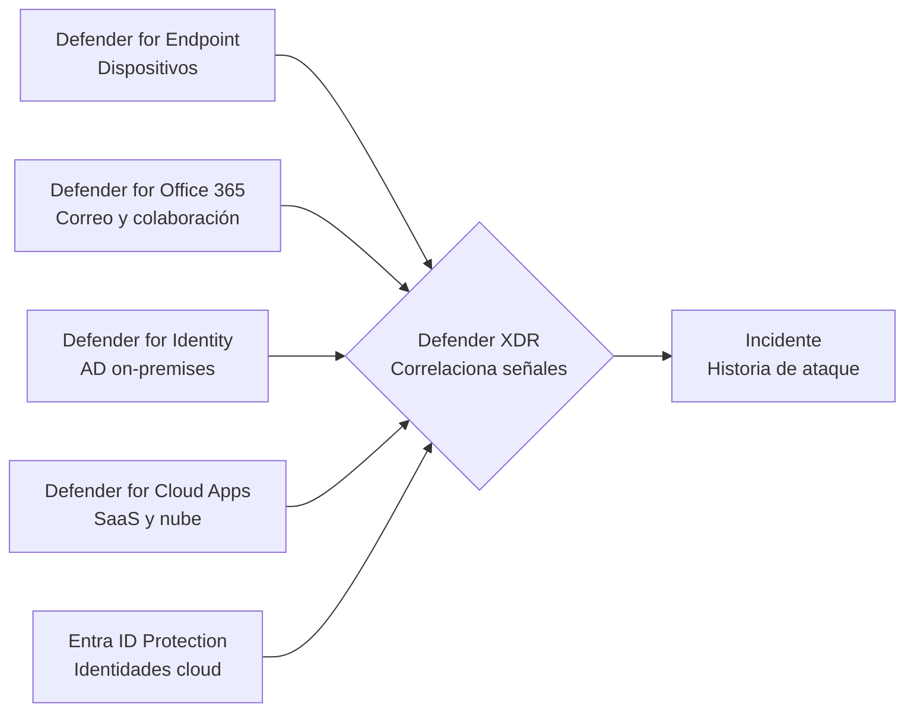

# Día 1 — Tomando el mando del SOC

> **Operación Centinela · Defender AnclaBank** — SC-200 Campaign · Ancla Lab
> **Dominio SC-200:** Manage a security operations environment (D1)
> **Fecha de estudio:** 1 jun 2026 · **Tenant:** E5 (`labmxsc200.onmicrosoft.com`)
> **Foco:** Portal de Microsoft Defender XDR como centro de mando del SOC.

---

## Briefing

### El concepto central: el modelo de correlación XDR

"Defender XDR" no es un producto: es el techo que une varios **sensores** y **correlaciona** sus señales en una sola historia de ataque. Cada sensor genera **alertas** por su cuenta; Defender XDR las agrupa automáticamente en **incidentes**.

El modelo mental que ordena todo el tema:

> **Señal → Alerta → Incidente → Entidades**



Consecuencias prácticas para el examen:
- Cuando **respondes** (Dominio 2), trabajas a nivel **incidente** (la historia completa), no alerta por alerta.
- Un incidente trae enganchadas sus **entidades** (dispositivos, usuarios, buzones, archivos, IPs): son los objetos sobre los que ejecutas acciones de remediación.
- El Dominio 1 (40–45% del examen) se trata de **configurar y operar** este entorno, no solo de mirarlo.

### El mapa del portal (`security.microsoft.com`)

| Sección | Para qué sirve |
|---|---|
| **Incidents & alerts** | Cola de trabajo / triage |
| **Hunting** | Advanced hunting (KQL) y Custom detection rules |
| **Threat analytics** | Inteligencia sobre campañas activas |
| **Actions & submissions** | Action center: qué remedió la automatización |
| **Assets** | Devices e Identities |
| **System → Settings** | Donde se configura todo |

### Las dos palancas del día
1. **Notificaciones** — para que el incidente correcto llegue a la persona correcta sin ahogar al equipo en ruido.
2. **Advanced features** (MDE) — toggles que cambian el comportamiento global del motor (investigación automática, live response, etc.).

---

## Operación de Campo

### Tarea 1 — Recon del tablero e investigación de un incidente real
1. Entrar a `security.microsoft.com` → **Incidents & alerts → Incidents**.
2. Familiarizarse con las columnas (Severity, Status, Categories, Impacted assets) y filtros.
3. Abrir un incidente y recorrer sus pestañas: **Attack story** (grafo), **Alerts**, **Assets/Entities**, **Evidence and Response**.

### Tarea 2 — Configurar notificaciones por correo
1. **System → Settings → Microsoft Defender XDR → Email notifications**.
2. Crear regla de **Incidents** (`AnclaBank - Incidentes High`): filtrar por severidad High/Medium, destinatario propio.
3. Crear regla de **Threat analytics** (avisa cuando Microsoft publica inteligencia nueva relevante al tenant — proactivo, distinto a una detección real).

### Tarea 3 — Reconocer Advanced features de MDE
1. **System → Settings → Endpoints → General → Advanced features**.
2. Entender cada toggle clave: Automated Investigation, Live Response, EDR in block mode, Tamper protection, Allow/block indicators, Device discovery.
3. Por cada uno responder: *"si lo apago, ¿qué pierdo?"* (formato típico de pregunta de examen).

> **Nota de lab:** en un tenant recién provisionado, el menú **Endpoints** y el botón de descarga del paquete de onboarding pueden no aparecer hasta que MDE termine de aprovisionarse y la licencia esté asignada **al usuario**. Esta tarea se completó una vez que el tenant ya tenía dispositivos e incidentes reales.

---

## Hallazgos del lab — Incidente 31

**Título:** `Hands-on keyboard attack was launched from a compromised account (attack disruption)`

| Campo | Valor |
|---|---|
| Severidad | Alto |
| Alertas correlacionadas | 19 |
| Dispositivo | PCFabian |
| Usuario comprometido | **Fabian** |
| Cuenta creada por el atacante | **svc_test_655** |
| Artefactos de simulación | SimSvc_5105, SimStartUp_5105.bat |
| IP | 192.168.1.83 |

**Técnicas MITRE ATT&CK:**
- `T1136.002` — Create Account: Domain Account (persistencia)
- `T1136.001` — Create Account: Local Account (persistencia)
- `T1218.010` — System Binary Proxy Execution: Regsvr32 (ejecución / evasión de defensas)

**Decodificación del título:**
- *Hands-on keyboard* → atacante **humano** tecleando comandos en vivo (intrusión interactiva, alta severidad).
- *from a compromised account* → opera a través de una identidad legítima ya comprometida (Fabian).
- *(attack disruption)* → **Automatic Attack Disruption ya actuó**: el sistema correlacionó señales de alta confianza y contuvo el ataque **sin esperar a un analista**.

**Evidencia forense en el grafo:** el comando `net user svc_test_655 ********** /add` (creación de cuenta local, T1136.001) más la alerta *"New group added suspiciously"* (escalada de privilegios).

> El nombre `svc_test_655` con prefijo "svc" es un truco clásico: las cuentas de servicio levantan menos sospechas.

---

## Checkpoint

**1.** ¿Qué rol de Defender XDR le das a un analista que necesita *responder* a incidentes (aislar dispositivos, ejecutar remediaciones) pero **sin** poder cambiar la configuración global del tenant?

**2.** Diferencia entre **tuning**, **suppression** y **correlation**.

**3.** KQL: lista los últimos 10 procesos ejecutados en las últimas 24h, mostrando solo `Timestamp`, `DeviceName` y `FileName`.

<details>
<summary>Ver respuestas</summary>

**1.** **Security Operator.** (Ojo: *L1/L2/L3* son niveles de madurez del SOC, **no** roles de Defender XDR.) Jerarquía built-in: *Security Reader* (solo lectura) → *Security Operator* (responde, no configura) → *Security Administrator* (configura y responde). Respuesta avanzada: **Unified RBAC** permite roles custom con permisos granulares.

**2.**
- **Tuning** → el paraguas: reglas que automáticamente ocultan, resuelven o reclasifican alertas para bajar el ruido (corrige falsos positivos).
- **Suppression** → una acción dentro del tuning: ocultar positivos verdaderos rutinarios/autorizados (lo benigno conocido).
- **Correlation** → agrupar alertas relacionadas en un mismo incidente.

**3.**
```kusto
DeviceProcessEvents
| where Timestamp >= ago(24h)
| project Timestamp, DeviceName, FileName
| top 10 by Timestamp desc
```
Errores comunes a evitar: la tabla es `DeviceProcessEvents` (no `AlertEvidence`); y para las *últimas* 24h se usa `Timestamp >= ago(24h)` (con `<=` traerías lo **más viejo** que hace 24h).

</details>

---

## Conceptos clave para el examen
- Modelo **Señal → Alerta → Incidente → Entidades**; XDR correlaciona **cross-product** (MDE + MDO + MDI + MDCA + Entra ID).
- Roles built-in: **Security Reader / Operator / Administrator** + Unified RBAC.
- Dirección de `ago()`: `>= ago(Xh)` = últimas X horas.
- **Attack disruption** = respuesta automática de alta confianza, sin intervención humana.
- Notificación de **incidente** (detección real) ≠ notificación de **Threat analytics** (inteligencia proactiva).

## Lecciones aprendidas
- Cola de incidentes vacía en un tenant nuevo = **normal**, no es error.
- **Siempre confirma con qué identidad y en qué tenant estás operando** antes de tocar nada (lección de SOC real: estaba logueado con la cuenta de Azure for Students en vez de la del tenant).
- Botón "Descargar paquete de incorporación" en gris → revisar aprovisionamiento de MDE, licencia asignada **al usuario**, y rol (Global/Security Admin).

---

*Operación Centinela · Ancla Lab · `Marco-Security` · Camino al SOC* 
