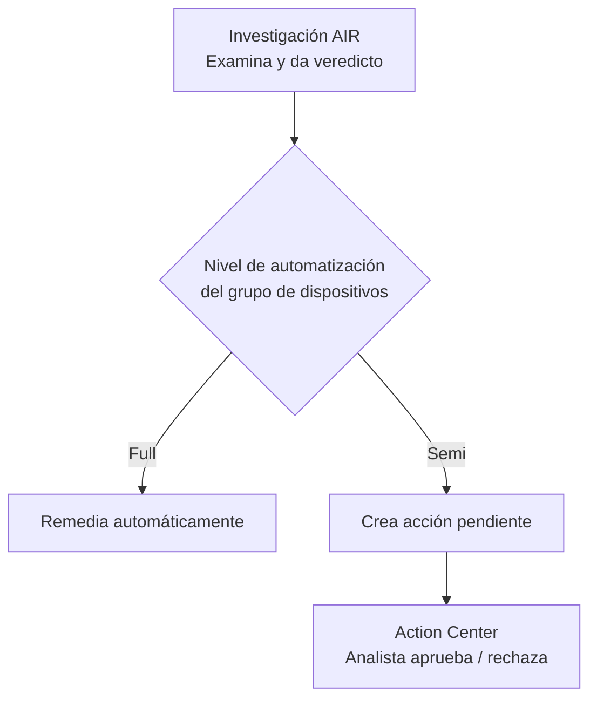

# Día 2 — Los robots del SOC: AIR + ASR

> **Operación Centinela · Defender AnclaBank** — SC-200 Campaign · Ancla Lab
> **Dominio SC-200:** Manage a security operations environment (D1) — *Configure automation*
> **Fecha de estudio:** 2 jun 2026 · **Tenant:** E5 (`labmxsc200.onmicrosoft.com`)
> **Foco:** Automatización de la defensa en dos frentes: respuesta (AIR) y prevención (ASR).

---

## Briefing

La idea que ordena todo el día:

> **AIR automatiza la *respuesta*. ASR automatiza la *prevención*.**

### AIR — Automated Investigation and Response

Es el "analista robot" de Defender. Cuando una alerta dispara, AIR puede lanzar una **investigación automática**: examina las entidades (archivos, procesos, servicios, drivers, claves de registro…), les asigna un **veredicto** (malicioso / sospechoso / limpio) y, según la configuración, **remedia solo** o **deja la acción pendiente** para aprobación humana.

La decisión clave es el **nivel de automatización**, configurado por **grupo de dispositivos**:



Niveles de automatización:
- **Full** — remedia todas las amenazas automáticamente.
- **Semi** (3 variantes) — requiere aprobación: para *cualquier* carpeta / solo *core folders* / solo *non-temp folders*.
- **No automated response** — no recomendado.

> Dato de examen: los tenants nuevos suelen venir en **Full** por defecto. Tanto las acciones Full (automáticas) como las Semi (aprobadas) quedan registradas en el **Action Center**.

### ASR — Attack Surface Reduction

Si AIR limpia *después* del ataque, ASR cierra puertas *antes*. Son **reglas** que bloquean comportamientos riesgosos típicos de malware.

Reglas de alto valor:
- *Block Office apps from creating child processes*
- *Block credential stealing from LSASS*
- *Block executable content from email and webmail*
- *Block process creations from PSExec and WMI commands*
- *Use advanced protection against ransomware*

Modos de cada regla: **Disabled · Audit · Warn · Block**.

> Regla de oro operativa (y de examen): **despliega siempre en Audit primero** para medir el impacto, y solo después pasa a **Block**. Audit es una fase de transición, no un destino. Se configuran desde Intune (lo común), GPO, PowerShell o el portal de MDE.

---

## Operación de Campo

### Tarea 1 — Destripar una investigación de AIR
1. Incidente 31 → pestaña **Investigaciones**.
2. Identificar: qué entidades examinó, a qué **veredicto** llegó, qué acciones generó.
3. Las acciones (tomadas/pendientes) se ven en la pestaña **Registro** de la investigación y en el **Action Center**.

### Tarea 2 — Encontrar el nivel de automatización
1. **System → Settings → Endpoints → Permisos → Grupos de dispositivos**.
2. Revisar la columna **Nivel de corrección** de cada grupo.
3. Conectar configuración ↔ comportamiento: *"si está en Full, por eso el sistema remedió solo".*

### Tarea 3 — Crear una regla ASR en Audit
1. **Intune → Seguridad de endpoints → Reducción de la superficie expuesta a ataques → Crear directiva** (Windows, perfil *Attack Surface Reduction Rules*).
2. Poner en **Audit**: *Block Office apps from creating child processes* y *Block credential stealing from LSASS*.
3. **Asignar la directiva a un grupo** (paso crítico — sin asignación no aplica).
4. *Bonus KQL* — ver eventos ASR auditados:
   ```kusto
   DeviceEvents
   | where ActionType startswith "Asr"
   ```

---

## Hallazgos del lab

### AIR — Investigación #10 ("Powessere prevented from executing")
AIR examinó automáticamente **1,877 entidades**:

| Tipo de entidad | Cantidad |
|---|---|
| Files | 791 |
| Processes | 145 |
| Services | 254 |
| Drivers | 432 |
| IP Addresses | 10 |
| Persistence Methods | 245 |

- Veredicto general: **No se encontraron amenazas** (la mayoría limpias; algunas "Desconocido", que ≠ malicioso).
- **No generó acciones de remediación**: el malware *Powessere* (fileless, abusa de binarios en línea de comandos como regsvr32/PowerShell) fue **bloqueado en el intento** (*prevented from executing*); para cuando AIR revisó, el equipo ya estaba limpio.
- **Lección clave:** ningún humano revisa 432 drivers + 245 métodos de persistencia a mano. AIR hace triage automático a una escala imposible para una persona. Ese es su propósito.

### Device groups
- 3 grupos (*Grupo 1*, *Monitoreo*, *Dispositivos desagrupados*) → **todos en "Corrección completa" (Full)**.
- Confirma por qué Attack Disruption contuvo a `svc_test_655` sin pedir aprobación.

### ASR
- Directiva creada en **Audit**, pero quedó en **"Asignado: No"** → no protege ni registra nada todavía.
- `DeviceEvents | where ActionType startswith "Asr"` → **0 resultados** (esperado: Audit solo registra cuando el comportamiento ocurre + política sin asignar).
- Sufijos de `ActionType`: `...Audited` = regla en Audit (solo registró) · `...Blocked` = regla en Block (frenó la acción).

---

## Checkpoint — Triage en AnclaBank

**1.** Creaste una directiva ASR pero está **"Asignado: No"**. ¿Qué le falta para proteger de verdad? Y si dejaras las reglas en **Audit** para siempre, ¿qué problema tendrías?

**2.** Llega una alerta de robo de credenciales (LSASS) en un servidor de un grupo en nivel **Semi**. AIR investiga y propone **aislar el equipo**. ¿La acción se ejecuta sola? ¿Dónde la buscas?

**3.** Empareja: ¿cuál **previene** que el malware fileless se ejecute y cuál **investiga y limpia** tras una detección? → **AIR** / **ASR**.

<details>
<summary>Ver respuestas</summary>

**1.** Falta **asignarla a un grupo** de dispositivos (sin asignación, una política de Intune no se aplica a nada). Dejar Audit permanente da **visibilidad sin defensa**: verías los ataques pero no los frenarías. Audit es una fase de transición hacia Block.

**2.** **No se ejecuta sola** (es Semi → requiere aprobación humana). La acción queda en estado **Pending** en la pestaña *Pending actions* del **Action Center**; al aprobarla pasa a *History*.

**3.** **ASR previene** que el malware fileless se ejecute (cierra la puerta antes). **AIR investiga y limpia** tras la detección (entra después).

</details>

---

## Conceptos clave para el examen
- **AIR = respuesta automática · ASR = prevención automática.**
- Nivel de automatización (**Full / Semi / No**) se define **por grupo de dispositivos**.
- Acciones Semi → **Pending** en Action Center; Full → ejecutadas y registradas en *History*.
- Modos ASR: **Audit → (Warn) → Block**; siempre **audit-first**.
- `ActionType` ASR: `...Audited` vs `...Blocked`.
- El **grupo de dispositivos** es la unidad de control: define automatización **+ RBAC + políticas**. Se evalúa por **rank** (de arriba abajo, gana la primera coincidencia); el grupo predeterminado siempre queda al final.

## Lecciones aprendidas
- Una **política de Intune sin asignar no protege nada** (error clásico: "configuré la regla y no pasa nada").
- Una regla ASR en **Audit no genera telemetría pasivamente** — solo registra cuando el comportamiento vigilado ocurre.
- Configuración ↔ comportamiento: los 3 grupos en Full explican la contención automática del incidente 31.

---

*Operación Centinela · Ancla Lab · `Marco-Security` · Camino al SOC* 
