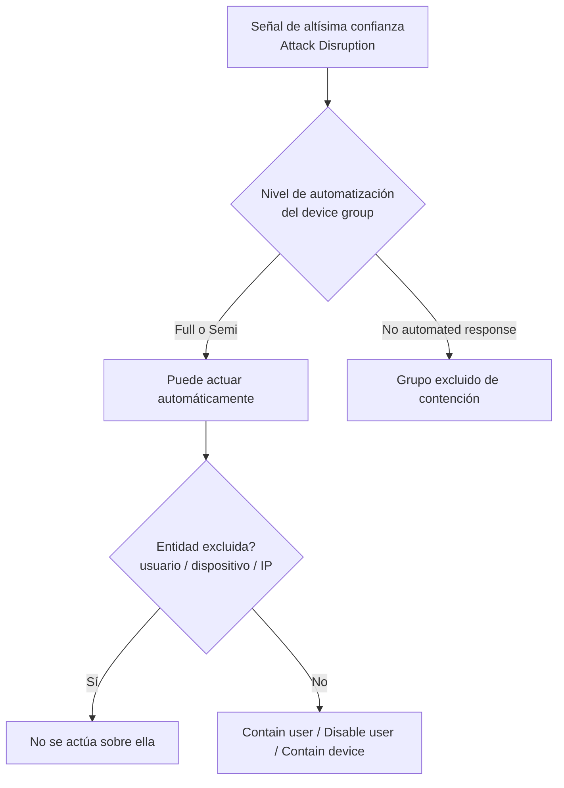

# Día 3 — Attack Disruption + Device Groups

> **Operación Centinela · Defender AnclaBank** — SC-200 Campaign · Ancla Lab
> **Dominio SC-200:** Manage a security operations environment (D1) — *Configure automation*
> **Fecha de estudio:** 3 jun 2026 · **Tenant:** E5 (`labmxsc200.onmicrosoft.com`)
> **Foco:** Contención automática de ataques activos y el "tablero de control" que la gobierna.

---

## Briefing

### Automatic Attack Disruption

Capacidad de Defender XDR que **contiene un ataque activo en tiempo real**, correlacionando señales de **altísima confianza** en todo el ecosistema XDR. No dispara con cualquier alerta: solo con escenarios de alto impacto y alta certeza (ransomware operado por humanos, BEC, phishing AiTM).

**AIR vs Attack Disruption** (distinción clave de examen):

| | AIR | Attack Disruption |
|---|---|---|
| Qué hace | Investiga entidades y las remedia | **Contiene** el ataque activo |
| Cuándo dispara | Tras una alerta (amplio) | Solo señales de **altísima confianza** |
| Acciones | Limpieza (cuarentena, etc.) | Contain device · Disable user · Contain user |
| Velocidad | Investigación (minutos) | **Inmediata** (segundos) |

**Las 3 acciones de contención automáticas:**
- **Contain user** → los dispositivos onboarded a MDE bloquean la actividad de la cuenta (corta movimiento lateral) a nivel endpoint. Requiere agente Sense reciente.
- **Disable user** → deshabilita la cuenta en AD; se apoya en Defender for Identity (requiere "action account" en MDI).
- **Contain device** → aísla a nivel de red un equipo comprometido, incluso uno no administrado.

> Attack Disruption puede actuar sin importar el estado del antivirus (Active / Passive / EDR Block Mode). Todas sus acciones son **reversibles** desde el Action center.

### Device Groups — el tablero de control

Cada grupo de dispositivos define tres cosas: **nivel de automatización** (Full / Semi / No automated response), **RBAC** (qué analistas lo gestionan, columna *Grupos de usuarios*) y **rank** (columna *Clasificación*). Un dispositivo cae en el **primer grupo, de arriba abajo por rank, cuya regla coincida**; el grupo predeterminado siempre va al final.

**Conexión clave (y trampa de examen):** tanto **Full como Semi** permiten que Attack Disruption actúe sin aprobación manual. El **único** nivel que lo apaga es **No automated response** (recomendado solo para muy pocos dispositivos, porque también desactiva AIR en ese grupo).

### Dos modelos de exclusión (no confundir)
- **Exclusión de usuario / IP / dispositivo** (preciso) → *Settings → Microsoft Defender XDR → Respuesta automatizada → Identidades (o Dispositivos)*. Para blindar una cuenta puntual (ej. break-glass).
- **Nivel "No automated response"** (mazazo) → en el *grupo de dispositivos*. Saca a equipos completos de la respuesta automática.

---

## Operación de Campo

### Tarea 1 — Mapear las acciones de Attack Disruption (incidente 31)
1. **Centro de actividades → Historial** (repositorio central de todas las acciones del tenant).
2. Filtrar por *Tipo de acción* y *Origen de la acción = Interrupción de ataque*; **ampliar la ventana de tiempo** (no "1 semana").
3. Identificar la acción y su origen en la columna *Decisión tomada por*.

### Tarea 2 — Encontrar la config de exclusiones (solo observar)
1. **Settings → Microsoft Defender XDR → Respuesta automatizada → Identidades**.
2. Reconocer el botón *Agregar exclusión de usuario* y las columnas (Usuario / Dominio / SID / Entra ID).
3. Entender: aquí se blinda una cuenta para que Attack Disruption nunca la toque. (No modificar — tenant compartido.)

### Tarea 3 — Analizar los device groups (solo lectura)
1. **Settings → Endpoints → Grupos de dispositivos**.
2. Por cada grupo: *Clasificación* (rank), *Grupo de dispositivos*, *Dispositivos*, *Nivel de corrección*, *Grupos de usuarios* (RBAC). Las **reglas** se ven al abrir el grupo.
3. Determinar en qué grupo cae un equipo y por qué (primer match por rank).

---

## Hallazgos del lab

- **Acción de respuesta hallada (incidente 31):** *Liberar la contención del usuario* sobre `svc_test_655` (SID `S-1-5-21-...`), *Decisión: Approved*, *Decisión tomada por: **Attack disruption***. Es decir, **tanto la contención como su liberación fueron automáticas** en la simulación. La columna *Decisión tomada por* distingue acción automática vs manual.
- **Panel de exclusiones:** *Respuesta automatizada → Identidades* con **0 elementos** → ninguna cuenta excluida, por eso Attack Disruption pudo contener a `svc_test_655`.
- **Device groups:** 3 grupos — *Grupo 1* (rank 1, 1 disp.), *Monitoreo* (rank 2, 1 disp.), *Dispositivos desagrupados* (rank Última, 36 disp.) — **todos en "Corrección completa" (Full)**. *Grupos de usuarios* vacío (sin RBAC asignado aún).
- **PCFABIAN** cae en *Dispositivos desagrupados* por **no coincidir** con las reglas de los grupos de rank superior (el default atrapa lo que sobra).

---

## Checkpoint

1. Nombra las **3 acciones de contención automática** de Attack Disruption. ¿Cuál disparó en el incidente 31?
2. Tienes una cuenta **break-glass** que jamás debe ser deshabilitada automáticamente. ¿Cómo y **dónde** la proteges de Attack Disruption?
3. Quieres Attack Disruption en las laptops, pero un grupo de **servidores legacy/OT** debe quedar fuera de la contención automática. ¿Qué **nivel de automatización** le pones y cuál es el **costo**?

Ver respuestas

**1.** **Contain user · Disable user · Contain device.** En el incidente 31 disparó **Contain user** (sobre `svc_test_655`), porque la amenaza era la cuenta haciendo movimiento lateral; contenerla a nivel endpoint era el corte más rápido.

**2.** Con una **exclusión de usuario**, en *Settings → Microsoft Defender XDR → **Respuesta automatizada → Identidades** → Agregar exclusión de usuario*. ⚠️ Ojo: NO se usa "No automated response" (eso es para *grupos de dispositivos*, no para cuentas). Requiere rol **Security Administrator o superior**.

**3.** Laptops en **Full**; servidores legacy/OT en **No automated response** (es el único nivel que los saca de la contención automática). **Costo:** esos servidores quedan sin protección automática (ni Attack Disruption ni AIR actúan solos) y dependes de respuesta manual, más lenta. Por eso Microsoft lo recomienda solo para muy pocos dispositivos.

---

## Conceptos clave para el examen
- **Las 3 acciones:** Contain user (MDE/Sense) · Disable user (MDI) · Contain device (network isolation).
- **AIR ≠ Attack Disruption:** AIR investiga/remedia; Attack Disruption contiene en vivo con señales de altísima confianza.
- **Full y Semi** habilitan Attack Disruption; solo **No automated response** lo apaga.
- **Dos exclusiones:** usuario/IP/dispositivo (Respuesta automatizada → Identidades/Dispositivos) vs nivel "No automated response" (device group).
- **Rank:** primer grupo coincidente gana; predeterminado siempre al final.

## Lecciones aprendidas
- "Actividades" (dentro del incidente) ≠ "Centro de actividades / Historial" (repositorio central de todo el tenant).
- Al rastrear acciones, **ampliar la ventana de tiempo** o se ocultan filas antiguas.
- No confundir **exclusión de cuenta** (precisa) con **"No automated response"** (mazazo a un grupo de equipos).
- Configuración ↔ comportamiento: los 3 grupos en Full explican la contención automática del incidente 31.

---

*Operación Centinela · Ancla Lab · `Marco-Security` · Camino al SOC*
