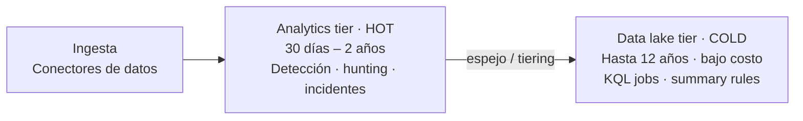

# Día 4 — Conectar el SIEM: roles y tiers

> **Operación Centinela · Defender AnclaBank** — SC-200 Campaign · Ancla Lab
> **Dominio SC-200:** Manage a security operations environment (D1) — *Configure the Sentinel SIEM and platform*
> **Fecha de estudio:** 8 jun 2026 · **Tenant:** E5 (`labmxsc200.onmicrosoft.com`) · **Workspace:** `sentinel-lab-2`
> **Foco:** Quién puede hacer qué (roles RBAC) y dónde viven los datos (tiers de retención).

---

## Briefing

Microsoft Sentinel es el **SIEM + SOAR** en la nube, hoy **unificado dentro del portal de Defender** (experiencia unificada SIEM + XDR). Dos cimientos antes de tocar datos: **roles** y **tiers**.

### Roles de Sentinel (Azure RBAC, privilegio mínimo)

> Los roles de Sentinel se asignan vía **Azure RBAC** sobre el workspace de Log Analytics o el grupo de recursos — **desde el portal de Azure (IAM)**, no desde el portal de Defender.

| Rol | Qué permite |
|---|---|
| **Microsoft Sentinel Reader** | Solo lectura (incidentes, datos, reglas) |
| **Microsoft Sentinel Responder** | Reader + **gestionar incidentes** (asignar, cambiar estado/severidad) |
| **Microsoft Sentinel Playbook Operator** | **Ejecutar** playbooks manualmente (no modificarlos) |
| **Microsoft Sentinel Contributor** | Responder + **crear/editar** reglas, workbooks, etc. |
| **Microsoft Sentinel Automation Contributor** | Permite que Sentinel **ejecute playbooks vía reglas de automatización** |

**Las dos llaves de examen:**
- Analista que **dispara un playbook a mano** sobre un incidente → **Responder + Playbook Operator**.
- **Regla de automatización** que ejecuta un playbook sola → dar a la identidad de servicio **Azure Security Insights** el rol **Automation Contributor** en el **grupo de recursos** del playbook. (Si el playbook no aparece en el desplegable, falta este permiso.)
- Playbook que actúa sobre una VM/recurso de Azure → dar a la **identidad administrada del playbook** el rol RBAC adecuado (ej. *Virtual Machine Contributor*) sobre ese recurso.

### Retención por tiers — dónde viven los datos

| Tier | Característica | Retención | Para qué |
|---|---|---|---|
| **Analytics** (hot) | Alto rendimiento, tiempo real | 30 días – 2 años | Detección, advanced hunting, incidentes |
| **Data lake** (cold) | Bajo costo, almacenamiento largo | Hasta **12 años** | KQL jobs, summary rules, search · **NO** tiempo real |
| **XDR** (default) | Datos de hunting de Defender XDR | **30 días** en Analytics | Siempre disponibles por defecto |

**Cómo se conecta con lo ya visto:**
- **Summary rules** → suben datos agregados (del lago o tablas ruidosas) al **Analytics tier** para consultar rápido sin timeout.
- **KQL jobs** → la forma de consultar el **Data lake**.
- **Blast radius / hunting graph** → requieren la infraestructura de grafo del **Data lake** de Sentinel (se auto-aprovisiona al entrar al portal de Defender si ya hay data lake).
- Tablas creadas con **Logs Ingestion API** o **AMA/DCR** se espejan al data lake; las de agentes legacy (MMA) **no**.

> **Trampa de examen:** cambiar una tabla de **Analytics → Data lake** hace que **dejen de funcionar** las reglas analíticas en tiempo real y el hunting sobre esa tabla. A cambio: costo mucho menor y retención de hasta 12 años.

---

## Operación de Campo

### Tarea 1 — Mapa de roles
1. Concepto: los roles de Sentinel se ven/asignan en **portal de Azure → workspace o RG → Access control (IAM) → Role assignments** (NO en el portal de Defender).
2. En tenant compartido normalmente no hay permiso para verlo → resolver el escenario de memoria: *"Tier 1 que ejecuta playbooks a mano = Responder + Playbook Operator".*

### Tarea 2 — Inspeccionar tiers de las tablas
1. Portal de Defender → **Microsoft Sentinel → Configuración → Tablas** (página de *Table management*).
2. Por cada tabla anotar: **tier** (Analytics / Data lake) y **retención**.

### Tarea 3 — Razonamiento de costo
1. Elegir la tabla de **mayor volumen** (ej. `DeviceNetworkEvents`, `DeviceProcessEvents`).
2. Abrir su panel (solo mirar) para ver los controles reales de tier y retención.
3. Decidir: *alto volumen + consulta rara + retención larga* → **Data lake** + **summary rule** para tendencias.

---

## Hallazgos del lab

Pantalla de inicio del portal de Defender (todo en una vista, leído con ojos de examen):
- **"Su SIEM y XDR unificados están listos"** → Sentinel integrado en el portal de Defender (experiencia unificada).
- **Optimización del SOC: 62 Active** → *SOC optimization* (recomendaciones de cobertura de detección y costo) — tema del Día 6.
- **Habilitar UEBA · 9 orígenes admitidos** → tablas `BehaviorInfo` / `BehaviorEntities`.
- **0 automation rules · 0 data connectors** → workspace en blanco: aún sin ingesta propia.

Tablas (Table management):
- **Todas en tier Analytics, retención 30 días** → es el **XDR tier por defecto** (datos de advanced hunting de Defender XDR).
- Como hay **0 data connectors**, las únicas tablas existentes son las default de XDR; no hay tabla custom de alto volumen que mover al lago todavía.

---

## Checkpoint

1. Un **Tier 1** debe gestionar incidentes y **ejecutar a mano** un playbook preconfigurado. Privilegio mínimo → ¿qué **dos roles**?
2. Logs de firewall de **altísimo volumen**, casi nunca consultados, a guardar **7 años**. ¿Qué **tier**? ¿Reglas en tiempo real sobre ellos?
3. Mueves una tabla de **Analytics → Data lake**. ¿Qué se rompe y qué ganas?

Ver respuestas

**1.** **Responder** (gestionar el incidente) + **Playbook Operator** (ejecutarlo a mano). *(Si fuera una regla de automatización la que lo dispara → Automation Contributor sobre la identidad Azure Security Insights.)*

**2.** **Data lake tier.** NO es posible correr reglas analíticas en tiempo real sobre esa tabla; se consulta con **KQL jobs** (y summary rules para tendencias).

**3.** Dejan de funcionar la **detección/hunting en tiempo real** sobre esa tabla; a cambio **bajas drásticamente el costo** y puedes retenerla **hasta 12 años**.

---

## Conceptos clave para el examen
- Roles: **Reader < Responder < Contributor**; **Playbook Operator** (ejecutar) y **Automation Contributor** (automatizar) son aparte.
- Manual playbook run = **Responder + Playbook Operator**. Automation rule run = **Automation Contributor** en *Azure Security Insights* (RG del playbook).
- Tiers: **Analytics** (hot, tiempo real, 30 d–2 a) · **Data lake** (cold, 12 a, sin tiempo real) · **XDR** (hunting de Defender, 30 d default).
- **Summary rule** = agregar al Analytics tier · **KQL job** = consultar el data lake · **blast radius** = necesita data lake + graph.
- Cambiar Analytics → Data lake **rompe** detección/hunting en tiempo real sobre esa tabla.

## Lecciones aprendidas
- **IAM no está en el portal de Defender** → vive en el portal de Azure (workspace/RG → Access control).
- Un workspace nuevo con **0 connectors** solo muestra las tablas default de XDR (Analytics / 30 días) — todo coherente con el tier XDR.
- La decisión de tiering (Analytics vs Data lake) es de **costo vs. capacidad de detección en tiempo real**: alto volumen + consulta rara + retención larga = Data lake + summary rule.

---

*Operación Centinela · Ancla Lab · `Marco-Security` · Camino al SOC* 
