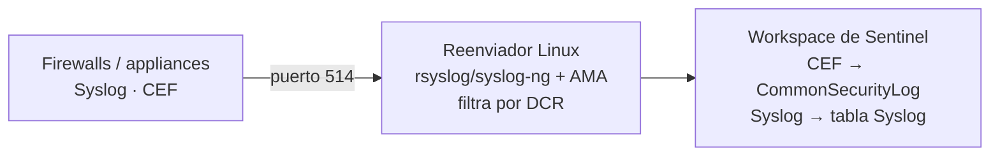

# Día 5 — Llenar el SIEM: los caminos de ingesta

> **Operación Centinela · Defender AnclaBank** — SC-200 Campaign · Ancla Lab
> **Dominio SC-200:** Manage a security operations environment (D1) — *Ingest data into the Sentinel SIEM and platform*
> **Fecha de estudio:** 9 jun 2026 · **Tenant:** E5 (`labmxsc200.onmicrosoft.com`) · **Workspaces:** `sentinel-lab-2` / `demola-05`
> **Foco:** Mapear cada tipo de fuente a su método de ingesta correcto.

---

## Briefing

Antes de detectar o cazar, los datos tienen que **entrar** a Sentinel. Cada fuente tiene **su** método correcto, y el examen vive de preguntar *"para esta fuente, ¿qué uso?"*.

### El árbol de decisión de ingesta

| Fuente de datos | Método correcto | Señal en el enunciado |
|---|---|---|
| Servicios M365 (SharePoint, Teams, Exchange) | Conector **Microsoft 365** | "eventos de SharePoint/Teams/Exchange" |
| Servicios de Microsoft (Entra, MDE, MDO…) | Conector **de servicio dedicado** (out-of-the-box) | nombre del servicio Microsoft |
| Eventos de seguridad de Windows | **Windows Security Events via AMA** | "security events de máquinas Windows" |
| Syslog / CEF (firewalls, appliances de red) | **Syslog/CEF via AMA** + **reenviador Linux** | "dispositivos de red", "CEF", "appliances" |
| Logs de muchos recursos Azure (existentes y futuros) | **Azure Policy** + diagnostic settings | "todos", "**futuros** también", "mínimo esfuerzo" |
| App custom con esquema JSON propio | **Log Ingestion API** + **DCR** + **tabla custom creada primero** | "JSON propio", "no coincide con tablas existentes" |
| TI curada por Microsoft | Solución **Threat Intelligence** + **Premium Defender TI** | "indicadores curados por Microsoft" |
| TI de plataforma de terceros | **TAXII** o **Upload API** + **registrar app en Entra** | "plataforma TI de terceros", "servidor TAXII" |

### El flujo Syslog/CEF vía AMA

- Los conectores **Syslog via AMA** y **CEF via AMA** instalan el **Azure Monitor Agent (AMA)** en una máquina **Linux** que actúa como **reenviador** (recolecta de los dispositivos de red). Por eso "lo primero" es **desplegar una máquina Linux**.
- Las **DCRs (Data Collection Rules)** definen qué sistemas monitorear, qué logs recolectar y los **filtros** a aplicar **antes** de la ingesta (mejor rendimiento + menor costo).
- **CEF → `CommonSecurityLog`** · **Syslog → tabla `Syslog`**.

### Los escenarios que más confunden
- **SharePoint/Teams/Exchange** → conector **Microsoft 365** (NO Syslog; Syslog es para dispositivos de red).
- **Muchos recursos Azure, existentes y futuros, mínimo esfuerzo** → **Azure Policy** que aplica diagnostic settings automáticamente. ⚠️ El **AMA NO** sirve para logs de plataforma de recursos PaaS (ej. Key Vault) — el AMA es para **máquinas**.
- **App con JSON custom vía Log Ingestion API** → **crear la tabla custom PRIMERO** (el esquema destino debe existir).
- **TI curada por Microsoft** → solución TI + **Premium Defender TI**. TAXII/Upload API son para **terceros** (que requieren **registrar app en Entra ID**).

---

## Operación de Campo

### Tarea 1 — Explorar Content hub y Data connectors
1. **Microsoft Sentinel → Administración de contenido → Content hub**: abrir (sin instalar) soluciones M365, Windows Security Events, CEF, Threat Intelligence; ver qué tablas alimentan.
2. **Configuración → Data connectors**: observar el catálogo y el estado (conectados vs disponibles).

### Tarea 2 — Anatomía de una connector page
1. Secuencia clave: **Content hub (instalar solución) → Data connectors (abrir conector) → Open connector page → +Create DCR**.
2. Si el conector no aparece en *Data connectors*, es porque su **solución no está instalada** en el Content hub.
3. Reconocer las 3 secciones de toda connector page: **Estado** (Conectado / Proveedor / Último registro) · **Requisitos previos** (permisos workspace, rol de inquilino, licencia) · **Configuración** (donde vive el +Create DCR).

### Tarea 3 — Mapear fuentes a método
- SharePoint Online → **conector Microsoft 365**.
- Firewall Palo Alto (CEF) → **CEF via AMA** + reenviador Linux → `CommonSecurityLog`.
- App con JSON propio (Log Ingestion API) → **crear tabla custom primero** + DCR.

---

## Hallazgos del lab

- **Solución CEF (Content hub):** instalarla despliega **dos conectores** → *CEF via AMA* y *CEF via Legacy Agent*. El **Legacy Agent** (Log Analytics agent / MMA) está **deprecado (31 ago 2024)** → **usar siempre AMA**.
- **Una solución del Content hub puede empaquetar varios conectores.**
- **Familia Threat Intelligence** (vista en Data connectors): *Microsoft Defender TI*, *Premium Microsoft Defender TI* (curados por Microsoft) vs *TAXII*, *TAXII Export*, *Threat Intelligence Platforms*, *Upload API* (terceros). Regla: **curado por Microsoft → (Premium) Defender TI; tercero → TAXII / Upload API (+ app en Entra)**.
- **Deprecaciones que salen en pantalla (muy de examen):**
  - *"Device specific AMA connectors have been deprecated"* → se consolidaron en Syslog/CEF via AMA genéricos.
  - *"HTTP Data Collector API not supported after September 14, 2026"* → lo nuevo es **Log Ingestion API + DCR**. Si una pregunta menciona "HTTP Data Collector API", es la opción **legacy/incorrecta**.
  - *Conector IRM heredado de Sentinel en desuso* → las alertas de IRM se enrutan vía **Defender XDR**.
- **Connector page del conector Insider Risk Management** (abre en `portal.azure.com`, Azure Security Insights): requisitos previos = permisos de workspace + **Global/Security Admin** + licencia **M365 E5 / E5 Compliance**. (Conecta con Q22: descarga masiva antes de baja → IRM, plantilla "data theft by departing users".)

---

## Checkpoint

1. Recopilar eventos de **SharePoint Online**. ¿Qué conector agregas?
2. 25 Azure Key Vaults (y se crean nuevos seguido); todos, existentes y futuros, deben mandar diagnostic logs a Sentinel automáticamente, mínimo esfuerzo. ¿Qué configuras?
3. App con **JSON propio** vía Log Ingestion API, esquema que no coincide con tablas existentes. ¿Qué creas **primero**?
4. Ingerir **CEF de un firewall**: ¿qué despliegas primero y en qué **tabla** caen los logs?

Ver respuestas

**1.** Conector **Microsoft 365** (cubre SharePoint, Teams y Exchange Online).

**2.** **Azure Policy + diagnostic settings** (aplica la config a recursos existentes y futuros automáticamente). El **AMA NO** aplica a logs de plataforma PaaS como Key Vault.

**3.** Una **tabla de log personalizada** en el workspace de Log Analytics (el esquema destino debe existir antes de ingerir).

**4.** Desplegar primero el **reenviador Linux con AMA**; los logs **CEF** caen en **`CommonSecurityLog`** (los Syslog puros en la tabla **`Syslog`**).

---

## Conceptos clave para el examen
- **M365 connector** = SharePoint + Teams + Exchange.
- **Syslog/CEF via AMA** = reenviador Linux + AMA + DCR → `CommonSecurityLog` (CEF) / `Syslog`.
- **Azure Policy** = logs de muchos recursos Azure existentes **y futuros** automáticamente.
- **Log Ingestion API + DCR** (reemplaza al HTTP Data Collector API) → con esquema propio, **crear la tabla custom primero**.
- **TI:** Premium Defender TI (Microsoft) vs TAXII/Upload API (terceros, + app en Entra).
- **AMA siempre** (Legacy Agent deprecado).

## Lecciones aprendidas
- Secuencia: **Content hub instala la solución → el conector aparece en Data connectors**. Si "el conector no aparece", instala primero la solución.
- Algunas connector pages aún abren en el **portal de Azure** (experiencia unificada).
- Las pantallas están llenas de **avisos de deprecación** (Legacy Agent, device-specific AMA, HTTP Data Collector API, IRM heredado) — leerlos es media respuesta de examen.
- Anatomía de connector page: **Estado / Requisitos previos / Configuración**.

---

*Operación Centinela · Ancla Lab · `Marco-Security` · Camino al SOC* 
