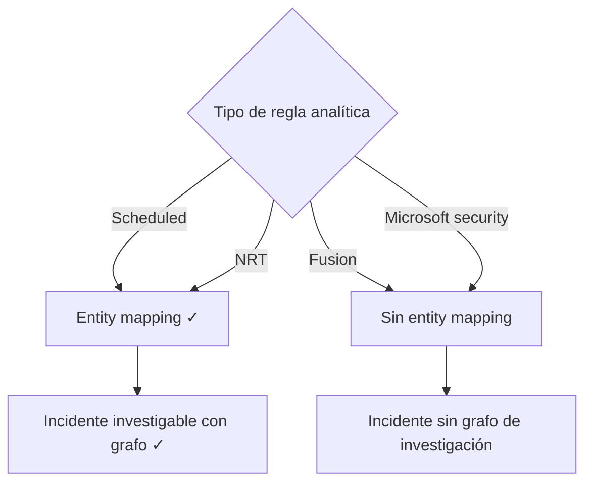

# Día 6 — Detectar, visualizar y optimizar

> **Operación Centinela · Defender AnclaBank** — SC-200 Campaign · Ancla Lab
> **Dominio SC-200:** Manage a security operations environment (D1) — *Configure detections* · **cierre del Dominio 1**
> **Fecha de estudio:** 9 jun 2026 · **Tenant:** E5 (`labmxsc200.onmicrosoft.com`) · **Workspaces:** `sentinel-lab-2` / `demola-05`
> **Foco:** Reglas analíticas, custom detections, workbooks, MITRE coverage y SOC optimization.

---

## Briefing

### Reglas analíticas (las detecciones de Sentinel)

| Tipo de regla | Qué hace | Entity mapping | Incidente investigable con grafo |
|---|---|:---:|:---:|
| **Scheduled** | KQL programado (cada X tiempo) | ✅ | ✅ |
| **NRT** (Near-Real-Time) | KQL casi en tiempo real (~1 min) | ✅ | ✅ |
| **Fusion** | ML multi-etapa, correlaciona fuentes | ❌ | ❌ |
| **Microsoft security** | Crea incidentes desde alertas de productos Defender | ❌ | ❌ |
| **Threat Intelligence** | Cruza indicadores TI contra logs | ❌ | — |
| **Anomaly** | ML con umbrales personalizables | — | — |

**La clave (Q21):** solo **Scheduled y NRT** soportan **entity mapping** (mapear columnas a entidades: Account, Host, IP…). El grafo de investigación **necesita entidades**, así que solo esas dos generan incidentes investigables con grafo.

**Custom detection rules (Defender XDR)** — distintas de las analytics rules de Sentinel: se crean desde una consulta de **Advanced Hunting** y la query **debe devolver dos columnas obligatorias** (Q40):
- **`Timestamp`** → marca la hora de las alertas generadas.
- **`ReportId`** → permite rastrear los registros originales.

**Conectar regla → playbook (Q20):** si el playbook se dispara con la *creación del incidente*, no se configura dentro de la regla — se crea una **regla de automatización** con la acción "Ejecutar playbook" (aplica a Scheduled y NRT).

### Workbook vs Playbook vs Notebook (Q11-13)

| Herramienta | Para qué | Señal |
|---|---|---|
| **Workbook** | **Visualizar** datos: paneles, gráficas, tendencias | "reporte", "visualizar a lo largo del tiempo" |
| **Playbook** | **Automatizar** respuesta (Logic App) | "respuesta automática", "acción" |
| **Notebook** | Investigación avanzada con **Jupyter** (ML, Python) | "Jupyter", "hunting con código" |

- Reporte que visualiza alertas en el tiempo → **Workbook**.
- Personalizar una **plantilla** de workbook → **clonarla primero** (las plantillas son de solo lectura) (Q12).

### MITRE ATT&CK coverage y SOC optimization

- **Matriz MITRE ATT&CK**: columnas = **tácticas** (en orden de kill chain), cajas = **técnicas**, coloreadas por nivel de cobertura (**None / Low / Medium / High**). Filtros clave: **Active rules** (cobertura real) y **Simulated rules** (what-if: cómo mejoraría si activaras ciertas plantillas).
- **SOC optimization**: recomendaciones automáticas en dos tipos:
  - **Coverage / threat-based** → "te falta detección contra esta amenaza" → acción: **activar reglas/conectores**.
  - **Data value** → "ingieres una tabla cara que no usa ninguna detección" → acción: **mover a tier barato (Data lake)** o **darle uso**.

---

## Operación de Campo

### Tarea 1 — Asistente de Analytics
1. **Microsoft Sentinel → Configuración → Análisis → Create → Scheduled query rule**.
2. En el paso **Set rule logic**, ubicar **Entity mapping** (+ Add new entity → tipos: Account, Host, IP, URL, File…).
3. Notar: la **Rule query (KQL) es obligatoria** ("value must not be empty"); pasos del asistente: General → Set rule logic → Incident settings → **Automated response** → Review + create.

### Tarea 2 — Workbooks + MITRE coverage
1. **Administración de amenazas → Libros (Workbooks)**: abrir una plantilla (ej. *Microsoft Defender for Endpoint*), notar el parámetro interactivo **TimeRange** y que para editar hay que **clonar**.
2. **Administración de amenazas → Ataque MITRE ATT&CK**: leer la matriz, identificar técnicas cubiertas vs huecos, y los filtros Active vs Simulated.

### Tarea 3 — SOC optimization
1. Abrir **Optimización del SOC**.
2. Clasificar 2-3 recomendaciones en **coverage** vs **data value**.

---

## Hallazgos del lab

**Analytics rule wizard (Scheduled):**
- Sección **Entity mapping**: *"Map up to 10 entities recognized by Microsoft Sentinel"* — la prueba viva de Q21.
- Rule query obligatoria; pasos del asistente incluyen *Automated response* (donde se enlaza con automatización).

**Workbook (MDE Preview):**
- Pestañas Overview / Device / Network / File, con consultas sobre tablas `Device*` (ASR audit/blocks, Tor Clients, etc.) y parámetro **TimeRange: Últimas 48 horas**. Plantilla de solo lectura → clonar para editar.

**Matriz MITRE ATT&CK (`sentinel-lab-2`):**
- Técnicas con cobertura activa: *Command and Scripting* (1), *Account Manipulation* (4), *Exploit Public-Facing* (3), *Brute Force* (5).
- Conexión con incidente 31: T1136 (Account Manipulation) aparece cubierta — las detecciones que dispararon ese incidente pintan esa caja.

**SOC optimization (62 items · Active 62 / Completed 4):**
- *Threat-based (coverage):* IaaS Resource Theft (Low, 8/100 · 3/6), Human Operated Ransomware (Low, 3/48 · 2/3), AiTM (Medium, 16/42 · 4/6).
- *Data value:* "Utilized AuditLogs table and improved your SOC coverage".
- Filtro **Recommendation type** confirma la clasificación; vista **multi-workspace** (demola-05, sentinel-lab-2, gerasentinel).

---

## Checkpoint

1. De **Scheduled, Fusion, NRT, Microsoft security** → ¿cuáles generan incidentes **investigables con grafo**?
2. Custom detection rule en Defender XDR (desde Advanced Hunting): ¿qué **dos columnas** debe devolver la query?
3. Reporte que **visualiza** alertas en el tiempo → ¿qué creas? Para personalizar una **plantilla** de workbook, ¿primer paso?
4. SOC optimization: *"ingieres `FirewallLogs_CL` (alto volumen) pero ninguna regla la usa"* → ¿qué **tipo** de optimización y qué acción?

Ver respuestas

**1.** **Scheduled y NRT** (las únicas con entity mapping → único camino al grafo de investigación).

**2.** **`Timestamp`** y **`ReportId`**.

**3.** Un **Workbook**. Para personalizar una plantilla → **clonarla primero** (las plantillas son de solo lectura).

**4.** **Data value optimization**. Acción: **mover la tabla a un tier barato (Data lake)** o **darle uso** creando una regla que la consuma.

---

## Conceptos clave para el examen
- **Entity mapping** solo en **Scheduled + NRT** → únicas con incidente investigable con grafo.
- **Custom detection rule** (Defender XDR) requiere **Timestamp + ReportId**.
- Playbook por *creación de incidente* → se enlaza vía **regla de automatización** ("Run playbook").
- **Workbook** = visualizar · **Playbook** = automatizar · **Notebook** = Jupyter. Plantilla → **clonar** antes de editar.
- **MITRE coverage**: Active rules (real) vs Simulated rules (what-if).
- **SOC optimization**: coverage (activar detecciones) vs data value (tier/uso de datos).

## Lecciones aprendidas
- Toda regla **Scheduled necesita KQL**; las **Microsoft security** solo reenvían alertas de productos Defender (sin KQL propio).
- La matriz MITRE y SOC optimization responden la misma pregunta desde ángulos distintos: **¿dónde estoy ciego?**
- Todo se conecta: las tablas `Device*` (Día 4), eventos ASR (Día 2) y técnicas del incidente 31 (Día 1) aparecen en workbooks y en la matriz MITRE.

---

*Operación Centinela · Ancla Lab · `Marco-Security` · Camino al SOC 
