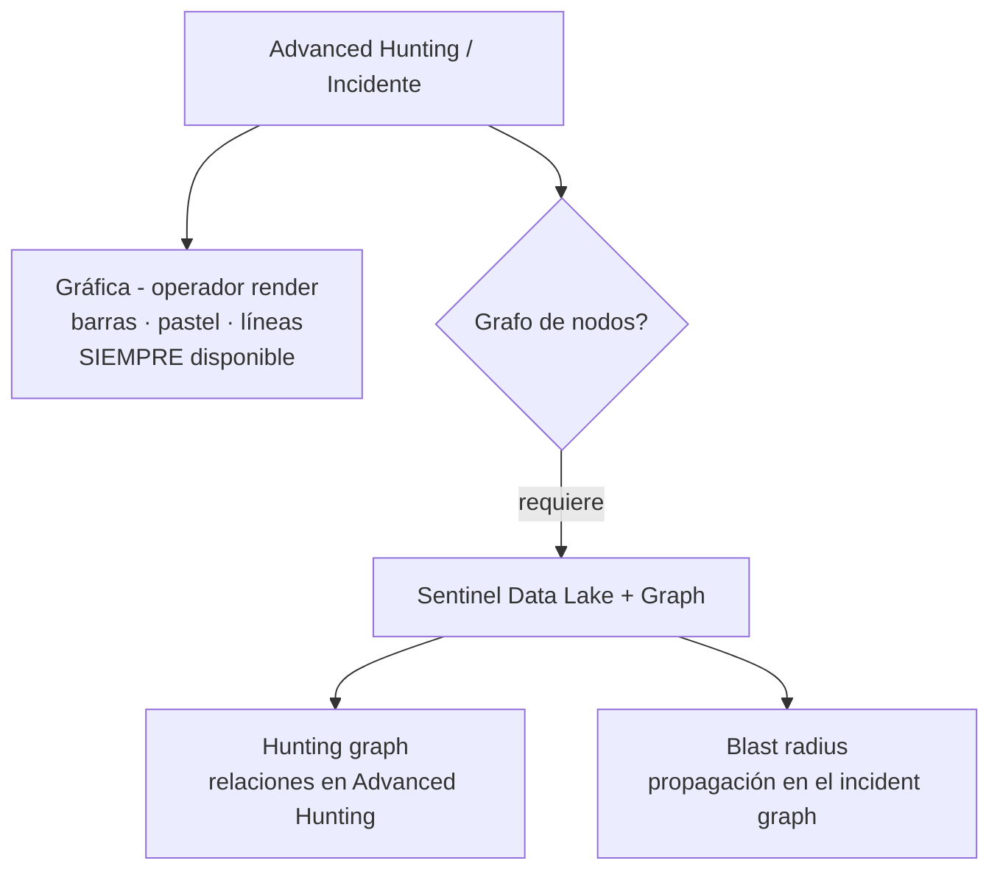

# Día 7 — Cazar en los datos: KQL, tablas y grafos

> **Operación Centinela · Defender AnclaBank** — SC-200 Campaign · Ancla Lab
> **Dominio SC-200:** Perform threat hunting (D3) — *Detect threats using Defender XDR*
> **Fecha de estudio:** 13 jun 2026 · **Tenant:** E5 (`labmxsc200.onmicrosoft.com`) · **Workspace:** `sentinel-lab-2`
> **Foco:** Advanced hunting con KQL, el esquema de tablas, y los grafos (hunting graph / blast radius).

---

## Briefing

El hunting es **buscar amenazas proactivamente** con KQL sobre la telemetría. El Dominio 3 tiene dos sabores: hunting en **Defender XDR** (advanced hunting + grafos, este día) y en la **plataforma Sentinel** (data lake, summary rules, notebooks — Día 8).

### Tablas de Advanced Hunting (elegir la correcta = la mitad del examen)

| Tabla | Qué contiene |
|---|---|
| `DeviceProcessEvents` | Procesos ejecutados |
| `DeviceNetworkEvents` | Conexiones de red |
| `DeviceEvents` | Eventos varios del endpoint (ASR, etc.) — **solo Windows/macOS, NO móviles** |
| `DeviceLogonEvents` | Inicios de sesión |
| `BehaviorInfo` | **Metadata** de comportamientos UEBA (título, descripción, categoría) |
| `BehaviorEntities` | Las **entidades** del comportamiento (usuario, dispositivo, IP) + EntityRole |
| `IdentityInfo` / `IdentityLogonEvents` | Identidades y sus logons |
| `SecurityAlert` | Alertas ingeridas (ej. **Entra ID Protection** ingiere aquí) |

- **`BehaviorInfo` vs `BehaviorEntities`:** *Info* = el comportamiento (título/descripción); *Entities* = quién/qué estuvo involucrado. Para "títulos y descripciones" → `BehaviorInfo`; `join` con `BehaviorEntities` para traer los UPN.
- **`DeviceEvents` no incluye Android/iOS:** un móvil onboarded **no aparece** en esa tabla.

### Gráfica vs Grafo (la confusión clásica)



- **Gráfica (`render`)** → visualiza *números* (barras, pastel, líneas). Siempre disponible.
- **Hunting graph** → grafo de **nodos y aristas** (relaciones entre entidades) dentro de Advanced Hunting. **Requiere data lake.**
- **Blast radius** → análisis de propagación dentro del **incident graph**; muestra rutas posibles desde el nodo comprometido hacia activos críticos. **Requiere data lake + Sentinel Graph.**
- **Incident graph** (≠ blast radius) → el grafo de entidades del incidente, siempre disponible; el blast radius es una capa avanzada *sobre* él.
- **Resolución de identidades:** si `user1` y `user1@contoso.com` salen como dos nodos, **sincronizar entidades de usuario con Entra ID** para unificarlas.

### KQL — operadores que caen
- **Filtrar:** `!=` (distinto), `==` (igual), `=~` (igual sin mayúsculas), `has` (término completo). Excluir un equipo → `| where DeviceName != "Device3"`.
- **Visualizar:** **`render`** (gráfica). `summarize` agrega · `project` selecciona · `extend` crea columna.
- **Combinar:** `union` (apila filas) · `join` (combina por columna).
- **Regla de oro:** la **primera línea es SIEMPRE la tabla**; los filtros van después.

---

## Operación de Campo

> Las queries KQL son de **solo lectura** — ejecutar no modifica nada.

### Tarea 1 — Explorar el esquema
1. Advanced Hunting → panel **Schema**: localizar `DeviceProcessEvents`, `DeviceEvents`, `BehaviorInfo`, `BehaviorEntities`.
2. Comparar columnas de `BehaviorInfo` (Title, Description) vs `BehaviorEntities` (EntityType, EntityRole, AccountUpn).

### Tarea 2 — Correr 3 queries
```kql
// 1. Últimos procesos lanzados por PowerShell
DeviceProcessEvents
| where Timestamp > ago(24h)
| where InitiatingProcessFileName =~ "powershell.exe"
| project Timestamp, DeviceName, FileName
| top 20 by Timestamp desc
```
```kql
// 2. Conexiones de red salientes, visualizadas
DeviceNetworkEvents
| where Timestamp > ago(24h)
| summarize Conexiones=count() by RemoteUrl
| top 10 by Conexiones
| render piechart
```
```kql
// 3. Join de comportamiento UEBA (BehaviorInfo + BehaviorEntities)
BehaviorInfo
| join BehaviorEntities on BehaviorId
| project ActionType, Description, EntityType, EntityRole
| take 20
```

### Tarea 3 — Grafos
1. Buscar el icono de **hunting graph** (nodos) sobre los resultados, o **"Ver blast radius"** en el grafo de un incidente.
2. Si no aparece → confirma que falta el **data lake** (esa ausencia es la respuesta de examen).

---

## Hallazgos del lab

- **Query 1:** PowerShell lanzando `auditpol.exe` repetidamente en `client2alan`. Patrón a vigilar: `auditpol` modifica políticas de auditoría → técnica de evasión (*Impair Defenses*, T1562).
- **Query 2 (`render piechart`):** 93.7% del tráfico hacia dominios de telemetría de Microsoft (`events.data.microsoft.com`, `windowsupdate`…). Lección de hunting de red: lo normal domina; lo *anómalo* sería una rebanada pequeña hacia un dominio raro. Confirmado el operador `render`.
- **Query 3 (`join` UEBA):** detectó un **Impossible Travel** real del usuario "Alan Rascón". `BehaviorInfo` aportó ActionType (ImpossibleTravel) y Description; `BehaviorEntities` aportó EntityType (User / CloudApplication / Ip) y EntityRole (Impacted / Related). Diferencia Info vs Entities vista con datos reales.
- **Grafos:** ni el hunting graph ni el blast radius aparecen → el workspace **no tiene data lake**. La ausencia confirma la dependencia: ambos requieren Sentinel data lake + Graph.
- **Gotcha de gráfica:** elegir un tipo de gráfico incompatible con la forma de los datos (categórica + numérica) da el error *"no se pueden representar en forma de gráfico"*.

---

## Checkpoint

1. Necesitas **títulos y descripciones** de comportamientos UEBA + los UPN. ¿Tabla de origen y con cuál haces `join`?
2. 4 equipos onboarded (Windows, Windows, **Android**, macOS). Query sobre `DeviceEvents`: ¿cuáles devuelve?
3. "Ver blast radius" no aparece en un incidente. ¿Qué configuras?
4. `user1` y `user1@contoso.com` salen como dos nodos. ¿Qué haces?
5. ¿Qué operador KQL convierte resultados en gráfica?

<details>
<summary>Ver respuestas</summary>

**1.** `BehaviorInfo` como origen + `join` con `BehaviorEntities` (on BehaviorId) para traer los UPN.

**2.** **Windows, Windows y macOS.** El Android se cae: `DeviceEvents` no incluye móviles.

**3.** Configurar **Sentinel para usar un data lake** (habilita el auto-aprovisionamiento de blast radius / hunting graph).

**4.** **Sincronizar las entidades de usuario con Entra ID** para que el grafo las resuelva como una sola identidad.

**5.** **`render`**.

</details>

---

## Conceptos clave para el examen
- **`BehaviorInfo`** = comportamiento (título/descripción) · **`BehaviorEntities`** = entidades. Se unen con `join`.
- **`DeviceEvents`** = solo Windows/macOS (NO móviles).
- **Entra ID Protection** ingiere en **`SecurityAlert`**.
- **Hunting graph** y **blast radius** requieren **Sentinel data lake + Graph**; la **gráfica `render`** no.
- **Blast radius ≠ incident graph**: el blast radius es una capa avanzada sobre el incident graph.
- Identidades duplicadas en el grafo → **sincronizar con Entra ID**.
- KQL: primera línea = la tabla; `!=` excluye; `render` grafica; `union` apila; `join` combina.

## Lecciones aprendidas
- **Gráfica (números) ≠ Grafo (relaciones entre nodos)**: el desplegable de visualización son tipos de gráfica (`render`), no el hunting graph.
- La ausencia de los grafos avanzados **es** la respuesta: dependen del data lake.
- Practicar KQL real fija las tablas mejor que memorizarlas: el `join` UEBA reveló un Impossible Travel auténtico.

---

*Operación Centinela · Ancla Lab · `Marco-Security` · Camino al SOC · Dominio 3 (parte 1) ✅* 
