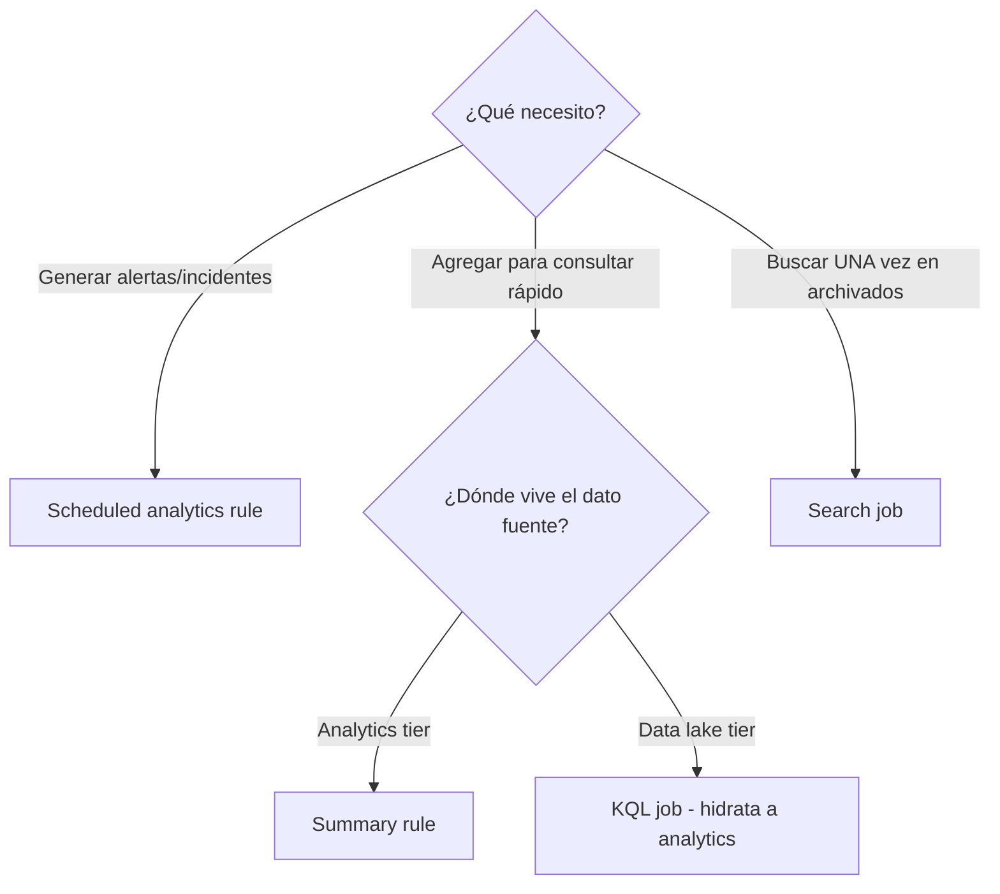

# Día 8 — Cazar en el data lake: KQL jobs, notebooks y MCP

> **Operación Centinela · Defender AnclaBank** — SC-200 Campaign · Ancla Lab
> **Dominio SC-200:** Perform threat hunting (D3) — *Detect threats using the Microsoft Sentinel platform* · **cierre del Dominio 3 y del blueprint**
> **Fecha de estudio:** 13 jun 2026 · **Tenant:** E5 (`labmxsc200.onmicrosoft.com`) · **Workspace:** `sentinel-lab-2`
> **Foco:** Cómo consultar el data lake (KQL jobs, notebooks), el desempate de las 4 features de agregación y el MCP server.

---

## Briefing

En el Día 7 cazamos sobre el Analytics tier (advanced hunting). Hoy: el **data lake** (tier frío, hasta 12 años). Los datos de las tablas de advanced hunting de Defender viven 30 días en su tabla y una copia se manda al data lake para usarse con custom graphs, MCP server, KQL jobs y notebook jobs.

### Las 3 formas de consultar el data lake

| Forma | Qué es | Cuándo |
|---|---|---|
| **KQL interactivo** (data lake explorer) | Consultas ad-hoc directo en el lago | Exploración rápida; puede hacer timeout en datasets grandes |
| **KQL job** | Consultas KQL asíncronas (una vez o programadas) sobre el data lake; **hidratan resultados del lago al Analytics tier** | Investigaciones largas (semanas/meses), baselines, anomalías históricas |
| **Notebooks** (Jupyter/Spark) | Analítica big data basada en Spark sobre una sola copia de los datos | Python, ML, datasets enormes |

> Nota: advanced hunting consulta tablas XDR + analytics (cómputo incluido). El data lake explorer solo consulta el lago (cómputo aparte).

### El desempate de las 4 features (Q48, Q49, Q50)

| Feature | Fuente | Destino | Recurrencia | Propósito |
|---|---|---|---|---|
| **Summary rule** | tabla **Analytics** (ruidosa) | tabla resumida **Analytics** | programada | consultar tendencias rápido |
| **KQL job** | **Data lake** | tabla **Analytics** (hidrata) | una vez o programada | promover datos históricos del lago |
| **Search job** | logs **archivados/históricos** | tabla nueva | **una sola vez** | búsqueda larga puntual en datos viejos |
| **Scheduled analytics rule** | Analytics | **incidentes/alertas** | programada | **detectar** amenazas |

**La pregunta decisiva:** ¿dónde vive el dato fuente (analytics o data lake) y es recurrente o una sola vez? "Agregación programada" aplica a varias, así que no sirve para decidir.

**Q48 en concreto:** un KQL job que **anexa a una tabla analytics existente** requiere que el **esquema de salida coincida** con el de la tabla destino. Si renombras una columna o agregas una nueva → falla. Solución: ajustar la query para que **nombres y tipos de columna coincidan** con el destino.

### MCP server + notebooks (lo más nuevo — Q49)

El **Sentinel MCP server** deja que **agentes de IA** (GitHub Copilot en VS Code, etc.) ejecuten hunting sobre el data lake. La colección de exploración de datos (en `sentinel.microsoft.com/mcp/data-exploration`) incluye: búsqueda semántica en el catálogo de tablas, ejecutar KQL sobre el lago (**`query_lake`**) y razonar sobre grafos (exposure, hunting, data risk).

**Q49 (cuenta invitada apunta al workspace equivocado):** agregar el header **`x-mcp-client-tenant-id`** a la definición del servidor MCP + especificar el **workspace id** en los prompts → autentica al tenant correcto y fija el workspace correcto.

---

## Operación de Campo

### Tarea 1 — Recorrer el Summary rule wizard
1. **Microsoft Sentinel → Configuración → Reglas de resumen → Crear**.
2. Paso **General**: campo **Destination table** → *Existing* vs *New custom log table* (origen del error de esquema de Q48).
3. Paso **Set summary logic**: la query exige operador **`summarize`** (sin él, avisa de costos); **Query scheduling** corre **cada 1 hora**, automáticamente.
4. **Review + create**: Destination table + Summary query + Time selector column (`TimeGenerated`) + Run every 1 hour + Start Automatically.

### Tarea 2 — Buscar las funciones del data lake
1. Buscar **KQL jobs / Data lake explorer / Notebooks** en el portal.
2. Si no aparecen → no hay **data lake** habilitado (mismo motivo que el hunting graph/blast radius ausentes del Día 7).

### Tarea 3 — Mapeo de escenarios
- (a) Tabla analytics ruidosa + timeouts + tabla chica → **Summary rule**.
- (b) Procesar logs del **data lake** y promover a analytics, programado → **KQL job**.
- (c) Buscar **una vez** un IOC en logs archivados → **Search job**.

---

## Hallazgos del lab

**Summary rule wizard (`sentinel-lab-2`):**
- Texto de cabecera: *"Create a summary rule to persist the results of scheduled query jobs"* → agregar + persistir, programado.
- **Destination table:** *Existing custom log table* vs *New custom log table* → la elección que origina el error de esquema de Q48.
- **Validación:** *"Missing 'summarize' operator in query"* + aviso de costos → el `summarize` es la esencia de la summary rule.
- **Query scheduling:** corre **cada 1 hora**, *Start running: Automatically* → rasgo recurrente (lo distingue del search job, que es one-off).
- **Time selector column:** `TimeGenerated`.

**Funciones del data lake:**
- **KQL jobs / Notebooks NO aparecen** → el workspace no tiene data lake. Las **Reglas de resumen sí** (operan sobre el Analytics tier). Contraste comprobado en vivo: summary rules disponibles, KQL jobs ausentes.

---

## Checkpoint

1. Tabla analytics de **alto volumen** con timeouts en tendencias; quieres una tabla chica en analytics. ¿Qué usas?
2. Agregación KQL programada sobre datos del **data lake**, promovida a analytics. ¿Summary rule o KQL job?
3. Un **KQL job** falla con *"el esquema de salida no coincide"* tras renombrar una columna. ¿Qué haces?
4. **Python/ML/Spark** sobre un dataset enorme del data lake. ¿Qué usas?
5. **MCP server** con cuenta invitada trae el workspace equivocado. ¿Qué configuras?

Ver respuestas

**1.** Una **Summary rule** (agrega del Analytics tier a una tabla resumida analytics, recurrente).

**2.** **KQL job** (fuente en data lake → hidrata a analytics).

**3.** Ajustar la query para que **nombres y tipos de columna coincidan** con el esquema de la tabla destino.

**4.** **Notebooks** (Jupyter/Spark, Python, ML).

**5.** Agregar el header **`x-mcp-client-tenant-id`** a la definición del MCP server + especificar el **workspace id** en los prompts.

---

## Conceptos clave para el examen
- **3 formas de consultar el lago:** KQL interactivo (rápido), **KQL job** (async, hidrata a analytics), **Notebooks** (Spark/Python/ML).
- **Summary rule** (analytics→analytics, recurrente) · **KQL job** (data lake→analytics) · **Search job** (archivados, una vez) · **Scheduled analytics rule** (detectar→incidentes).
- KQL job que anexa a tabla existente → **esquema debe coincidir**.
- **MCP server** (`query_lake`) para hunting con IA; cuenta invitada → header **`x-mcp-client-tenant-id`** + workspace id.
- Summary rules viven en **Analytics tier** (siempre); KQL jobs/Notebooks en **Data lake tier** (solo con data lake).

## Lecciones aprendidas
- La summary rule sin `summarize` no tiene sentido (y el portal lo advierte por costo).
- La **ausencia** de KQL jobs/Notebooks confirma que falta el data lake — igual que blast radius/hunting graph en el Día 7.
- La decisión entre las 4 features se reduce a dos preguntas: **¿dónde vive el dato?** y **¿recurrente o una vez?**

---

*Operación Centinela · Ancla Lab · `Marco-Security` · Camino al SOC · Dominio 3 · BLUEPRINT COMPLETO* 
