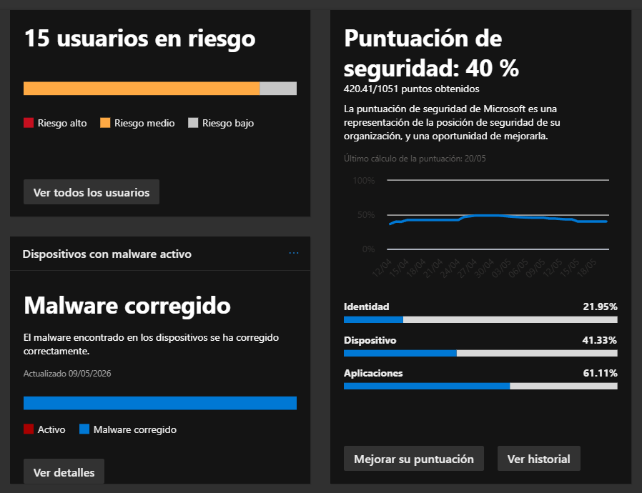
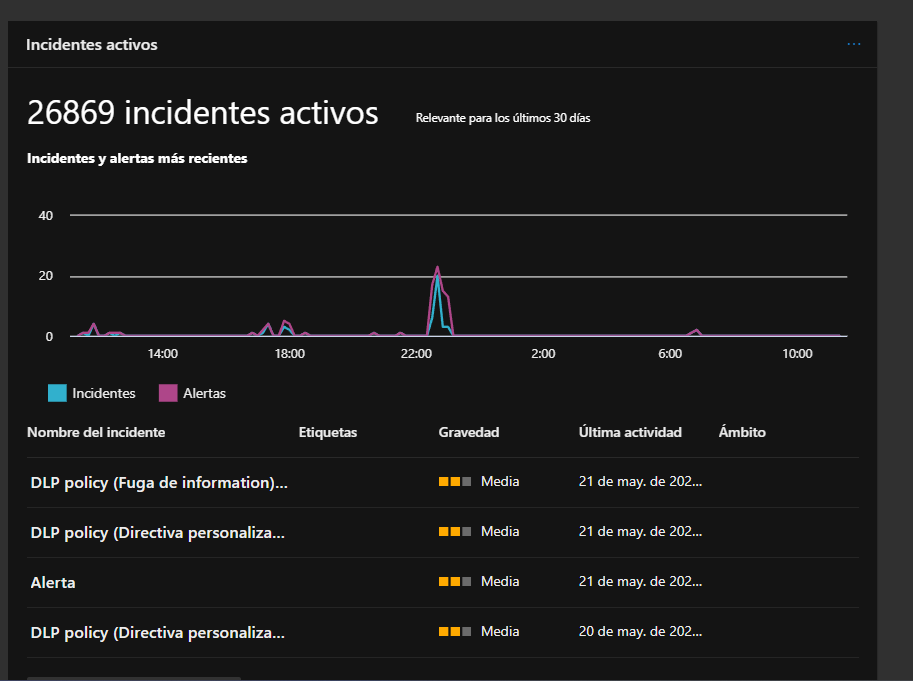

# Día 1 — Exploración del Tenant y Baseline de Seguridad

**Fecha:** 20/05/2026
**Herramientas:** Microsoft Defender XDR
**Autor:** Marco — Ancla Lab

---

## Objetivo

Explorar el tenant de Microsoft Defender XDR, establecer el baseline de seguridad
actual y priorizar las áreas de intervención para los próximos 19 días.

---

## Actividades Realizadas

1. Revisión del dashboard principal de Microsoft Defender XDR
2. Análisis del Secure Score y sus áreas de mejora
3. Revisión de usuarios en riesgo
4. Identificación de incidentes activos recientes
5. Revisión de Data Connectors en Microsoft Sentinel

---

## Baseline del Tenant — 20/05/2026

| Métrica | Valor | Estado |
|---------|-------|--------|
| Incidentes activos (30 días) | 26,869 | 🔴 Crítico |
| Usuarios en riesgo | 15 | 🟠 Alto |
| Secure Score global | 40% (420.41/1051) | 🟠 Medio |
| Malware activo | 0 — corregido | 🟢 OK |
| Data Connectors activos | 1 | 🟠 Limitado |
| Automation Rules | 0 | 🔴 Sin automatización |

### Secure Score por Área

| Área | Puntuación | Prioridad |
|------|-----------|-----------|
| Identidad | 21.95% | 🔴 Crítico — intervenir primero |
| Dispositivo | 41.33% | 🟠 Medio |
| Aplicaciones | 61.11% | 🟡 Aceptable |

### Top Recomendaciones del Secure Score

| # | Recomendación | Impacto | Categoría |
|---|--------------|---------|-----------|
| 1-5 | Corregir sensor de MDE en dispositivos | +0.95% c/u | Dispositivo |
| 6 | MFA para usuarios en roles privilegiados | +0.95% | Identidad |
| 7 | MFA para todos los usuarios | +0.86% | Identidad |
| 8 | Bloquear procesos de PSExec y WMI | +0.86% | Dispositivo |

**Hallazgo crítico en recomendación #7:**
27 de 27 usuarios NO tienen MFA registrado. Esto expone completamente
el tenant a ataques de fuerza bruta y credential stuffing.

### Incidentes Recientes (últimas 24h)

| Incidente | Gravedad | Fecha |
|-----------|----------|-------|
| DLP policy (Fuga de información) | Media | 21/05/2026 |
| DLP policy (Directiva personalizada) | Media | 21/05/2026 |
| Alerta | Media | 21/05/2026 |

---

## Hallazgos

1. **Alert fatigue severo** — 26,869 incidentes en 30 días con 0 Automation
   Rules indica que no hay supresión de falsos positivos automatizada.

2. **Identidad crítica al 21.95%** — 27 usuarios sin MFA es la vulnerabilidad
   más urgente del tenant. Cualquier contraseña comprometida da acceso total.

3. **Solo 1 Data Connector activo** — Sentinel tiene visibilidad muy limitada.
   Solo ingesta alertas de Microsoft Defender XDR.

4. **Malware corregido** — positivo. MDE está funcionando y remediando amenazas
   automáticamente.

5. **0 Automation Rules** — todo el triage de incidentes es manual, lo que
   hace inmanejable el volumen actual.

---

## Plan de Acción

| Prioridad | Acción | Día |
|-----------|--------|-----|
| 🔴 1 | Investigar incidentes críticos activos | Día 2 |
| 🔴 2 | Revisar dispositivos en riesgo Alto en MDE | Día 3 |
| 🔴 3 | Analizar TVM — vulnerabilidades en endpoints | Día 6 |
| 🟠 4 | Mejorar Secure Score de Identidad (21.95%) | Día 8 |
| 🟠 5 | Crear Automation Rules para reducir alert fatigue | Día 11 |

---

## Lecciones Aprendidas

- El Secure Score de Identidad al 21.95% con 27 usuarios sin MFA es el
  riesgo más crítico del tenant — la identidad es el vector de ataque principal
  en entornos cloud.
- 0 Automation Rules en un tenant con ~27K incidentes mensuales es insostenible.
  La automatización es urgente.
- El único Data Connector activo limita la visibilidad de Sentinel — se necesitan
  más fuentes para correlación efectiva.

---

*SOC Analyst Journal — Ancla Lab | Marco | Día 1 de 20*
