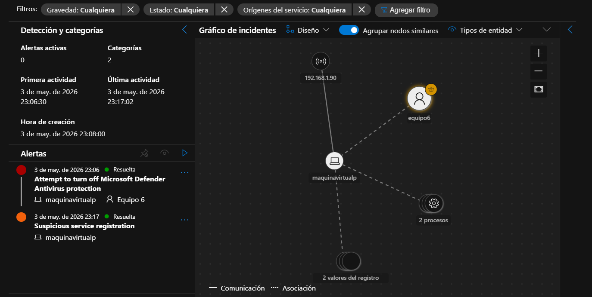

# Día 2 — Investigación de Incidente ID 37: Defense Evasion y Persistencia

**Fecha:** 21/05/2026
**Herramientas:** Microsoft Defender XDR, MDE
**Autor:** Marco — Ancla Lab
**Táctica MITRE:** TA0005 Defense Evasion, TA0003 Persistence

---

## Objetivo

Investigar el incidente de mayor criticidad del tenant — ID 37, clasificado como
"Multi-stage incident involving Persistence & Defense Evasion" — utilizando el
workflow completo de un SOC Analyst: incident graph, alertas, activos, evidencia
forense y resumen ejecutivo.

---

## Actividades Realizadas

1. Filtrar incidentes por severidad Alta en los últimos 30 días
2. Identificar y abrir el incidente ID 37
3. Revisar la Historia del ataque e incident graph
4. Analizar las 2 alertas agrupadas con sus tácticas MITRE
5. Revisar los Activos involucrados (dispositivos y usuarios)
6. Analizar la Evidencia forense (procesos, registro, IPs)
7. Leer el Resumen ejecutivo del incidente

---

## Incident Graph — ID 37



```
192.168.1.90
      |
   equipo6 (usuario)
      |
 maquinavirtualp (dispositivo)
      |
 ┌────┴────┐
 2 procesos    2 valores del registro
(powershell)  (DisableRealtimeMonitoring)
```

---

## Resumen del Incidente

| Campo | Valor |
|-------|-------|
| ID | 37 |
| Título | Multi-stage incident involving Persistence & Defense Evasion |
| Gravedad | 🔴 Alto |
| Estado | ✅ Resolved |
| Clasificación | True Alert |
| Asignado a | arascon@labmxsc200.onmicrosoft.com |
| Primera actividad | 3 may. 2026 — 23:06:30 |
| Última actividad | 3 may. 2026 — 23:17:02 |
| Duración | ~11 minutos |
| Etiquetas | Activo crítico, Defensa-Evasion, TA0005:Defense-Evasion |

---

## Alertas Agrupadas (2)

### Alerta 1 — Attempt to turn off Microsoft Defender Antivirus Protection
| Campo | Valor |
|-------|-------|
| Hora | 3 may. 2026 — 23:06 |
| Dispositivo | maquinavirtualp |
| Usuario | Equipo 6 |
| Categoría | Evasión de la defensa |
| Táctica MITRE | T1562.001 — Disable or Modify Tools |
| Táctica MITRE | T1562.006 — Indicator Blocking |
| Origen de detección | EDR (Microsoft Defender for Endpoint) |
| Estado | ✅ Resuelta |

### Alerta 2 — Suspicious Service Registration
| Campo | Valor |
|-------|-------|
| Hora | 3 may. 2026 — 23:17 |
| Dispositivo | maquinavirtualp |
| Categoría | Persistencia |
| Estado | ✅ Resuelta |

---

## Timeline del Ataque

| Hora | Proceso | Acción | Indicador |
|------|---------|--------|-----------|
| 19:54:15 | userinit.exe | Inicio de sesión legítimo | Normal |
| 19:54:16 | explorer.exe | Remote execution | 🟠 Sospechoso |
| 23:06:18 | powershell.exe (PID 8672) | Remote execution | 🔴 Sospechoso |
| 23:06:29 | powershell.exe | executed a script | 🔴 Sospechoso |
| 23:06:30 | powershell.exe | executed a script | 🔴 Sospechoso |
| 23:06:30 | powershell.exe | executed a script | 🔴 Sospechoso |
| 23:17 | services.exe (PID 884) | Registro de servicio sospechoso | 🔴 Persistencia |

---

## Activos Involucrados

| Tipo | Entidad | Dominio | Estado |
|------|---------|---------|--------|
| Dispositivo | maquinavirtualp | AAD joined | Activo crítico |
| Usuario | Equipo 6 | maquinavirtualp | Habilitado |

---

## Evidencia Forense (5 elementos)

| Tipo | Entidad | Veredicto |
|------|---------|-----------|
| Dirección IP | 192.168.1.90 | 🔴 Sospechosa |
| Proceso | powershell.exe (PID 8672) | 🔴 Sospechoso |
| Valor del registro | DisableRealtimeMonitoring | 🔴 Sospechoso |
| Valor del registro | ImagePath: 63-00-6D-00... | 🔴 Sospechoso |
| Proceso | services.exe (PID 884) | 🔴 Sospechoso |

---

## Cadena del Ataque (Kill Chain)

```
1. powershell.exe ejecutado remotamente
         ↓
2. Modifica registro de Windows:
   DisableRealtimeMonitoring = 1
         ↓
3. Microsoft Defender Antivirus desactivado
         ↓
4. services.exe registra nuevo servicio (persistencia)
         ↓
5. MDE detecta las dos acciones via EDR
         ↓
6. Incidente creado y resuelto por arascon@labmxsc200
```

---

## Tácticas MITRE ATT&CK

| ID | Nombre | Descripción |
|----|--------|-------------|
| T1562.001 | Disable or Modify Tools | Desactivar herramientas de seguridad |
| T1562.006 | Indicator Blocking | Bloquear indicadores de detección |
| TA0003 | Persistence | Registro de servicio sospechoso |
| TA0005 | Defense Evasion | Táctica principal del incidente |

---

## Hallazgos

1. **PowerShell ejecutado remotamente** es una técnica común de ataque —
   indica que el atacante ya tenía acceso al dispositivo antes de las 23:06.

2. **DisableRealtimeMonitoring** es una clave del registro de Windows que
   desactiva la protección en tiempo real de Defender. Su modificación es
   una señal de ataque activo.

3. **El incidente duró solo 11 minutos** desde la primera actividad hasta
   la última — MDE detectó y contuvo el ataque rápidamente.

4. **La cuenta de Equipo 6 sigue habilitada** — en un entorno real debería
   haberse deshabilitado temporalmente durante la investigación.

5. **El origen de detección fue EDR** — MDE detectó el comportamiento
   antes de que causara daño mayor.

---

## Lecciones Aprendidas

- El **Incident Graph** es la herramienta más poderosa para entender
  la cadena de ataque en segundos — muestra visualmente cómo se conectan
  entidades, procesos y valores del registro.
- **T1562.001** (desactivar Defender) siempre precede a la instalación
  de malware — cuando lo ves, asumes que hay un payload en camino.
- **True Alert** vs **False Positive** — este incidente fue correctamente
  clasificado como amenaza real. El contexto (powershell remoto + modificación
  de registro + registro de servicio) confirma intención maliciosa.
- En un SOC real, el siguiente paso sería ejecutar **Live Response** en
  `maquinavirtualp` para buscar el payload que probablemente se instaló
  después de desactivar el antivirus.

---

*SOC Analyst Journal — Ancla Lab | Marco | Día 2 de 20*
