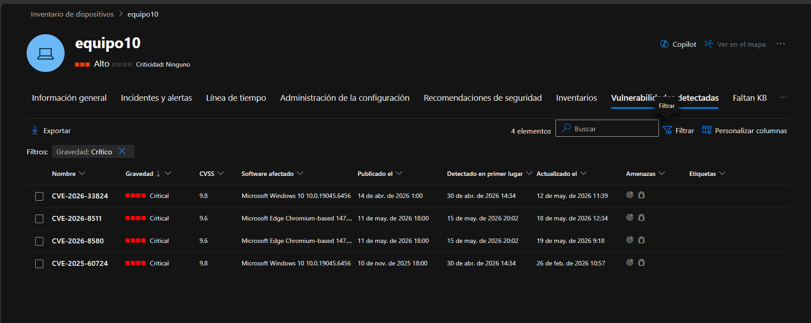

# Día 3 — Revisión de dispositivos en riesgo alto (MDE)

**Fecha:** 21/05/2026  
**Herramientas:** Microsoft Defender for Endpoint  
**Autor:** Marco — Ancla Lab

---

## Objetivo

Revisar los dispositivos con nivel de riesgo alto en MDE, identificar el estado
del sensor EDR en cada uno y analizar las vulnerabilidades críticas detectadas
por TVM.

---

## Inventario de dispositivos — resumen

Del total de 35 dispositivos en el tenant, 7 tienen nivel de riesgo alto:

| Dispositivo | Tipo | Dominio |
|-------------|------|---------|
| usuario1 | Estación de trabajo | AAD joined |
| mv-micdef | Estación de trabajo | Workgroup |
| equipo22 | Estación de trabajo | Workgroup |
| MVforSentinel | Servidor | Workgroup |
| equipo-4 | Estación de trabajo | Workgroup |
| equipo19 | Estación de trabajo | Workgroup |
| equipo10 | Estación de trabajo | Workgroup |

---

## Análisis detallado — equipo10

Este dispositivo fue seleccionado por aparecer en las alertas "Kevin Ruso"
revisadas el día anterior.

**Estado general:**
- Riesgo: Alto
- Nivel de exposición: Alto
- Alertas activas: 2 (1 Alta, 1 Informacional)
- Incidentes activos: 2
- Estado de mantenimiento: Inactive
- Último examen completo: Nunca realizado
- Usuario principal: Equipo 10
- SO: Windows 10 64-bit (22H2, compilación 19045.6456)

**Problemas con el sensor EDR:**
- EDR desactivado — no envía datos de telemetría a MDE
- Comunicación con EDR fallida
- Recolección de datos fallida
- Exploit Guard desactivado

Con el EDR desactivado, MDE tiene visibilidad casi nula sobre este dispositivo.
Cualquier actividad maliciosa pasaría sin detección.

---

## Vulnerabilidades críticas — equipo10

530 vulnerabilidades detectadas en total: 4 críticas, 350 altas, 166 medias, 10 bajas.

| CVE | CVSS | Software afectado | Publicada | Sin parchear desde |
|-----|------|------------------|-----------|-------------------|
| CVE-2026-33824 | 9.8 | Windows 10 | 14 abr 2026 | 30 abr 2026 |
| CVE-2026-8511 | 9.6 | Microsoft Edge | 11 may 2026 | 15 may 2026 |
| CVE-2026-8580 | 9.6 | Microsoft Edge | 11 may 2026 | 15 may 2026 |
| CVE-2025-60724 | 9.8 | Windows 10 | 10 nov 2025 | 30 abr 2026 |

**CVE-2025-60724** lleva sin parchear desde noviembre 2025 — más de 6 meses
con una vulnerabilidad CVSS 9.8 activa en el dispositivo.

**CVE-2026-33824** — análisis detallado:
- Tipo: Remote (ejecución remota de código)
- Descripción: Double-free en Windows IKE Extension, permite ejecutar código
  arbitrario sobre la red
- Exploit público: No disponible
- Kits de vulnerabilidades: No
- Corrección: Aplicar últimos parches de Windows Update

---

## Hallazgos

1. El EDR desactivado en equipo10 es el problema más urgente. Sin telemetría,
   MDE no puede detectar actividad maliciosa en tiempo real.

2. CVE-2025-60724 lleva más de 6 meses sin parchear con CVSS 9.8. En un
   entorno real esto sería un hallazgo crítico en cualquier auditoría.

3. Ninguna de las 4 CVEs críticas tiene exploit público por ahora, pero
   con scores de 9.6 y 9.8 el riesgo de que aparezca uno es alto.

4. El dispositivo nunca ha pasado un examen de antivirus completo — otro
   indicador de abandono en la gestión del endpoint.

---

## Lecciones aprendidas

- TVM muestra no solo qué vulnerabilidades existen sino hace cuánto fueron
  detectadas. La antigüedad es un dato crítico — una CVE de 6 meses sin
  parchear indica un problema de proceso, no solo técnico.
- Un dispositivo con EDR desactivado es un punto ciego para el SOC. Antes
  de confiar en la ausencia de alertas hay que verificar que el sensor
  esté funcionando.
- La priorización correcta es: CVSS alto + sin parchear hace más tiempo
  primero, independientemente de si hay exploit público o no.

---

*SOC Analyst Journal — Ancla Lab | Marco | Día 3 de 20*
